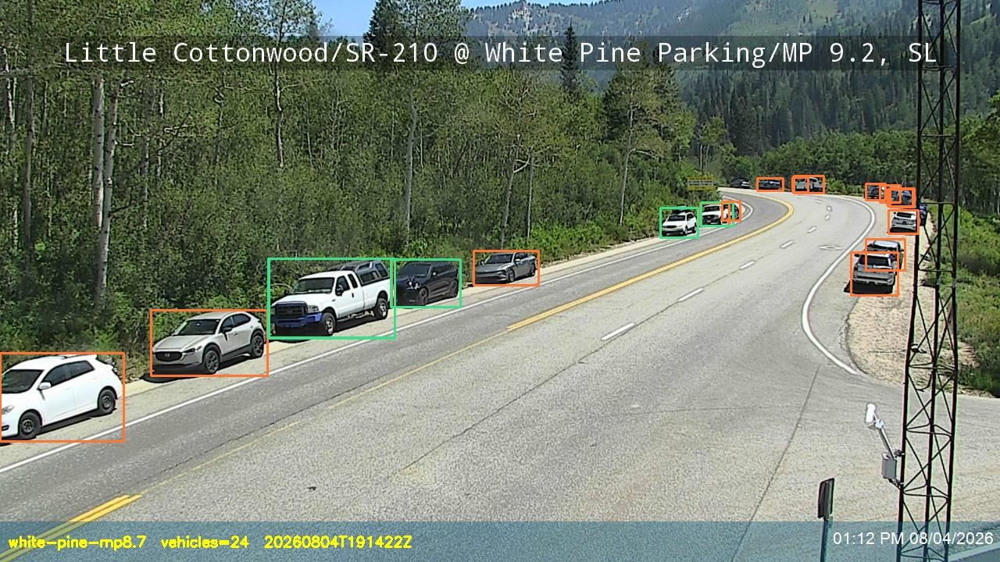

# canyon-watch

Vehicle counting for Little Cottonwood Canyon (SR-210, Utah) from public UDOT
traffic cameras, using [RF-DETR](https://github.com/roboflow/rf-detr) running
locally via [Roboflow Inference](https://github.com/roboflow/inference).

Every 10 minutes, a cron pulls snapshots from 7 cameras between the SR-209
intersection and Alta, counts vehicles on-device (Apple Silicon GPU), and
appends a time series — a canyon "busy-ness index" that feeds powder-day
traffic logic (anyone who has sat in the red snake on a powder morning knows).



## How it works

- **Cameras:** UDOT publishes ~1-minute snapshots at
  `https://www.udottraffic.utah.gov/map/Cctv/<id>`. No API key needed; the
  developer API only adds metadata, not faster frames.
- **Model:** `rfdetr-base` (Apache 2.0), run locally — no cloud calls, no
  per-frame cost. COCO classes filtered to car/truck/bus/motorcycle.
- **Dedup:** DETR-family models can emit the same physical vehicle under two
  classes (car 0.40 + truck 0.46). Detections are first filtered to vehicle
  classes, then class-agnostic NMS
  (`detections.with_nms(threshold=0.5, class_agnostic=True)`) keeps one box
  per object — without it, counts run ~20% hot. Found by hand-counting a
  frame against the model output. Filtering first stops a higher-confidence
  non-vehicle box (a person, a sign) from suppressing an overlapping car.
- **Guards:** near-black frames (night) are logged as `dark`, and failed or
  undecodable downloads (or frames over 10 MiB) as `error: ...`, rather than
  counted as zero traffic. `_canyon_total` sums the cameras that returned a
  count; its status says how many (`6/7 cams ok`).

## Run it

```bash
pip install inference supervision python-dotenv
echo "ROBOFLOW_API_KEY=<your key>" > .env
python canyon_watch.py
```

Outputs `canyon_watch/readings.jsonl` (one line per camera per poll, plus a
`_canyon_total`) and annotated snapshots per run.

Cron (every 10 minutes):

```
*/10 * * * * /path/to/python /path/to/canyon_watch.py >> canyon_watch/cron.log 2>&1
```

## Tests

The tests need no network, camera, model, torch or Roboflow key:

```bash
pip install -r requirements-dev.txt
pytest
```

## Note for Apple Silicon

Native (non-Docker) inference on M-series Macs currently crashes with
`AttributeError: module 'torch.mps' has no attribute 'current_device'` —
see [roboflow/inference#2757](https://github.com/roboflow/inference/issues/2757).
The script includes the one-line workaround.
